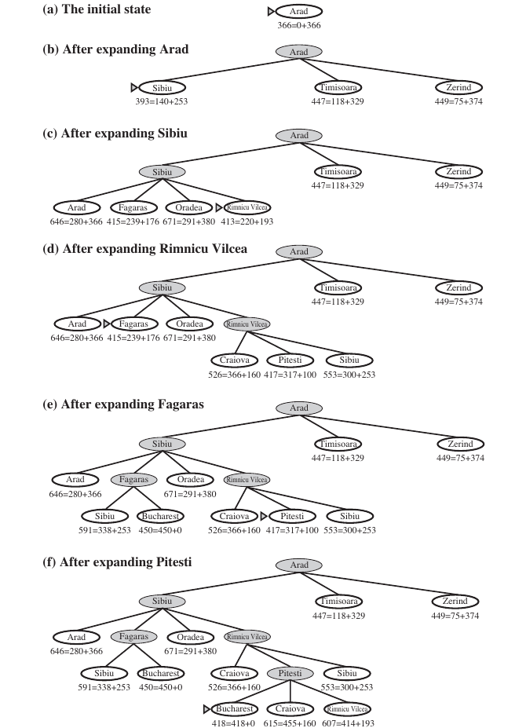

# Heuristique & définition

Mais concrètement ? Qu'est-ce qu'une heuristique ? **Wooclap time! (q3)**

Une heuristique peut être considérée comme une méthode de calcul mathématique ou empirique, spécialement conçue pour apporter des perspectives de résolutions à un problème spécifique. L'on en a recourt principalement lorsque le problème est complexe et qu'il ne peut être résolu en un temps raisonnable, ou qu'il est difficilement modélisable.


Le concept de temps raisonnable varie d'un contexte d'application à l'autre. Par exemple, prendre plusieurs semaines pour reconstituer l'image d'une coalescence de deux trous noirs est raisonnable, mais prendre le même temps pour calculer quel coup jouer à BloodBowl ne l'est pas.



Une heuristique est toujours, toujours, **dépendante du problème** auquel elle est rattachée !


L'objectif d'une fonction heuristique $$h(n)$$ est donc de produire ou d'aider à produire une solution **acceptable** en un temps **raisonnable** à un problème donné, en classant les solutions ou les états au fur et à mesure de l'exploration du problème. C'est une fonction **d'estimation** (de score).

Cela introduit donc la notion de **trade-off**. Autrement dit, puisqu'il ne s'agit plus d'une étude exhaustive du problème, mais qu'on choisit en amont les états à explorer, cela a un effet sur :
* La complexité
* L'optimalité
* La précision
* Le temps d'exécution
 
Concrètement, elles peuvent **aiguiller** la résolution du problème à l'aide des informations et des connaissances supplémentaires, ou d'élaguer (*pruning*) des espaces entiers de l'arbre de recherche sur simple calcul. Par exemple, dans le cas du voyageur de commerce, on peut commencer par prendre les distances les plus petites entre les villes, tel que $$min(h(n_1),\dots,h(n_m))$$ (distance en vol d'oiseau).

Attention toutefois, l'on peut avoir recours à la notion d'heuristique même en dehors d'une stratégie informée, c'est simplement qu'elle conditionne l'efficacité même de l'exploration dans le cadre d'une telle approche.


De par sa nature, on peut utiliser une fonction heuristique pour résoudre un problème alors qu'on ne connaît pas d'algorithme capable de le résoudre !


## Comment une heuristique fonctionne
On utilise une fonction heuristique $$h(n)$$ pour estimer le coût d'un état à l'aune de certains critères et des objectifs recherchés, souvent adosser à des coûts objectifs et calculables.

L'un des exemples les plus connus et intuitif est sans doute l'algorithme d'exploration par le meilleur d'abord (aussi connu sous le nom de *A**). Cette exploration $$f(n)$$ évalue les noeuds en combinant le coût effectif pour atteindre un noeud, noté $$g(n)$$, et $$h(n)$$ le coût estimé pour aller du noeud au but. Tel que :

$$
f(n) = g(n) + h(n)
$$

Dans la figure ci-dessus, on observe bien que l'algorithme élague de manière conséquente l'espace de recherche dans le graphe. Dans le cas de situation complexe, par exemple en présence de boucles et de cul-de-sac, un mécanisme de **backtracking** pourrait être implémenté afin de sortir des optima locaux.

Ainsi, $$f(n)$$ estime donc le coût de la solution la moins coûteuse passant par $$n$$.


Attention, $$h(n)$$ doit respecter des propriétés spécifiques pour en faire une heuristique complète et optimale. Référez vous à la section sur les propriétés des heuristiques.


## Quelques heuristiques courantes
**Wooclap time! (q4)**
