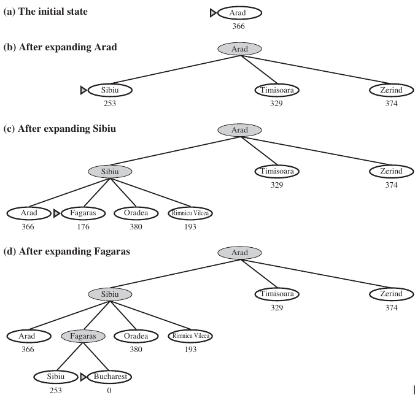
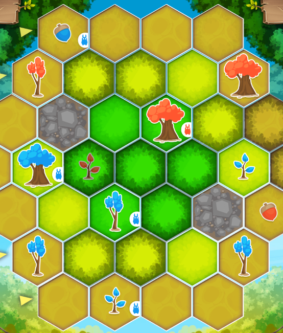

# Heuristique & définition

Mais concrètement ? Qu'est-ce qu'une heuristique ? **Wooclap time! (q3)**

Une heuristique peut être considérée comme une méthode de calcul mathématique ou empirique, spécialement conçue pour apporter des perspectives de résolutions à un problème spécifique. L'on en a recourt principalement lorsque le problème est complexe et qu'il ne peut être résolu en un temps raisonnable, ou qu'il est difficilement modélisable.


Le concept de temps raisonnable varie d'un contexte d'application à l'autre. Par exemple, prendre plusieurs semaines pour reconstituer l'image d'une coalescence de deux trous noirs est raisonnable, mais prendre le même temps pour calculer quel coup jouer à BloodBowl ne l'est pas.



Une heuristique est toujours, toujours, **dépendante du problème** auquel elle est rattachée !


L'objectif d'une fonction heuristique $$h(n)$$ est donc de produire ou d'aider à produire une solution **acceptable** en un temps **raisonnable** à un problème donné, en classant les solutions ou les états au fur et à mesure de l'exploration du problème. C'est une fonction **d'estimation** (de score).

Cela introduit donc la notion de **trade-off**. Autrement dit, puisqu'il ne s'agit plus d'une étude exhaustive du problème, mais qu'on choisit en amont les états à explorer, cela a un effet sur :
* La complexité
* L'optimalité
* La précision
* Le temps d'exécution
 
Concrètement, elles peuvent **aiguiller** la résolution du problème à l'aide des informations et des connaissances supplémentaires, ou d'élaguer (*pruning*) des espaces entiers de l'arbre de recherche sur simple calcul. Par exemple, dans le cas du voyageur de commerce, on peut commencer par prendre les distances les plus petites entre les villes, tel que $$min(h(n_1),\dots,h(n_m))$$ (distance en vol d'oiseau).



Attention toutefois, l'on peut avoir recours à la notion d'heuristique même en dehors d'une stratégie informée, c'est simplement qu'elle conditionne l'efficacité même de l'exploration dans le cadre d'une telle approche.


De par sa nature, on peut utiliser une fonction heuristique pour résoudre un problème alors qu'on ne connaît pas d'algorithme capable de le résoudre !


## Comment une heuristique fonctionne
On utilise une fonction heuristique $$h(n)$$ pour estimer le coût d'un état à l'aune de certains critères et des objectifs recherchés, souvent adosser à des coûts objectifs et calculables.

L'un des exemples les plus connus et intuitif est sans doute l'algorithme d'exploration par le meilleur d'abord (aussi connu sous le nom de *A**). Cette exploration $$f(n)$$ évalue les noeuds en combinant le coût effectif pour atteindre un noeud, noté $$g(n)$$, et $$h(n)$$ le coût estimé pour aller du noeud au but. Tel que :

$$
f(n) = g(n) + h(n)
$$


Dans la figure ci-dessus, on observe bien que l'algorithme élague de manière conséquente l'espace de recherche dans le graphe. Dans le cas de situation complexe, par exemple en présence de boucles et de cul-de-sac, un mécanisme de **backtracking** pourrait être implémenté afin de sortir des optima locaux.

Ainsi, $$f(n)$$ estime donc le coût de la solution la moins coûteuse passant par $$n$$.


Attention, $$h(n)$$ doit respecter des propriétés spécifiques pour en faire une heuristique complète et optimale. Référez vous à la section sur les propriétés des heuristiques.


## Quelques heuristiques courantes
**Wooclap time! (q4)**

Voici quelques heuristiques couramment utilisées/utilisables, et à adapter pour vos problèmes.

* Vol d'oiseau
* Distance de Manhattan (1-distance) : $$d_m=[x_b - x_a] + [y_b - y_a]$$
* Distance de Euclidienne (2-distance) : $$d_e=\sqrt{\sum_{i=1}^{n}(x_i - y_i)^{2}}$$
* Distance de Tchebychev (∞-distance) : $$d_t=\lim_{p \to \inf}\sqrt[p]{\sum_{i=1}^{n}\vert x_i - y_i \vert^{p}} = \sup_{1\leq i \leq n}\vert x_i - y_i \vert$$
* Du coup nul : Dans une situation d'adversité, principalement en tour par tour, on explore l'état du problème comme si l'adversaire avait joué deux fois d'affiler
* Des degrés : Dans une situation d'états interdépendants par des variables partagées (*e.g.* coloration de graphes), sélectionner la variable impliquée dans le plus grand nombre de contraintes
* Valeur la moins contraignante : IDEM, sauf qu'ici il s'agit d'exclure le moins de choix pour les variables voisines ; autrement dit qui enfreint le moins les contraintes chez les voisins
* min-conflict : Extension de l'heuristique précédente, où il s'agit de sélectionner la valeur associée à l'état qui minimise les conflits avec les autres variables. Principalement utilisé dans les CSP (problèmes à satisfaction de contraintes)
* Minimum Remaining Values / fail-first : Sélectionner la variable avec le moins de valeurs assignables possible
* Niveau maximal : Prend le niveau maximal de tous les buts

Mais vous pouvez tout a fait définir vous même vos propres heuristiques.
Par exemple, Spring Coding Game Challenge en 2021


```c++
// © Jérémie Humeau
int bestSeeder(int _idCell){ //quel arbre est le plus intéressant pour envoyer une graine ?
        int max=0;
        int tmp, tmp2, actionScore;
        for(int i=0; i<6; i++){
            tmp=board[_idCell].neighbors[i];
            if(tmp>=0){
                for(int j=0; j<6; j++){
                    tmp2=board[tmp].neighbors[j];
                    if(tmp2>=0 && board[tmp2].richness>0 && board[tmp2].tree<0){
                        actionScore=compute_score_seed(_idCell, tmp2);
                        if(actionScore>max){
                            max=actionScore;
                        }
                    }
                }
            }
        }
        return max;
    }
```

## Différence entre Heuristique, Meta-heuristique et Hyper-heuristique
**Wooclap time! (q5, q6)**

### Heuristique
Comme précédemment mentionné, une heuristique exploite les connaissances spécifiques au domaine. La **conséquence** est qu'elle **n'est pas facilement** ou **ne peut pas être** transposée pour résoudre d'autres problèmes.

Une autre conséquence de l'exploration partielle qu'une heuristique engendre est qu'elle peut être bloquée dans un **optima local**.

### Meta-heuristique
Théoriquement, une méta-heuristique (*MH*) est **agnostique** au problème. Autrement dit, elle ne dépend pas d'une connaissance spécifique au domaine du problème pour le résoudre. Elles sont aussi conçues pour être **plus robuste** aux optima locaux. Par exemple, les algo gen utilisent entre autre un principe de mutation pour sortir de ces optima.


Attention, une méta-heuristique n'est pas simplement meilleur qu'une heuristique. Par expérience, le ratio (effort de mise en place)/(résultat) penche du côté des MH, mais une heuristique exploitant correctement le domaine du problème et tirant des conclusions fortes aura probablement de meilleurs résultats, en plus d'avoir pour elle une explicabilité plus forte quant à la solution obtenue.


### Hyper-heuristique
Les travaux de recherches et les expérimentations ont mis en lumière que certaines *MH* se comportaient mieux sur certains problèmes ; et que, pour un même problème, différentes *MH* étaient plus performantes en fonction des instances du problème ou même de l'instant à laquelle elles sont utilisées dans le problème.

C'est là qu'intervienne les hyper-heuristiques : définir la séquence de MH (voire d'heuristiques) à choisir pour résoudre au mieux un problem donné. Elles sont également intéressantes pour classifier quelles MH fonctionnent le mieux en fonction d'un problème.

## Petit playground
**Wooclap (q7)**

Vous pouvez vous amuser à tester différentes heuristiques pour des algorithmes de *path-findings*, et tester différentes méthodes de *path-findings*, [ici](https://qiao.github.io/PathFinding.js/visual/) !