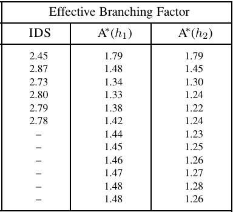

# Heuristique et qualité

La notion de qualité d'une heuristique est multi-dimensionnelle ; elle dépend du prisme par lequel on la regarde (gain en temps, en espace, qualité des solutions...). De plus, comme on l'a vu, il est souvent difficile de s'assurer de l'optimalité d'une heuristique pour notre problème. 

De fait, les critères qui quantifient cette notion de qualité sont variées ; parmi celles-ci, j'en ai vu trois de manière récurente.

## Search Cost
Il s'agit d'un terme "global", et du plus facile à appréhender. 
Cela consiste à faire intervenir différents critères dans la qualité. Par exemple, le temps pris par l'algorithme pour résoudre le problème, ou encore l'espace mémoire pris lors de la résolution.

C'est une métrique assez facile à mettre en oeuvre.

## Effective Branching Factor (EBF) $b*$

L'EBF s'appuie sur la notion de branching factor et de la simplification qu'une heuristique permet de faire lors de l'exploration du problème.

Concrètement, si pour une solution de profondeur $d$, et $N$ le nombre total de noeuds générés pendant l'exploration, alors $b*$ est le branching factor qu'une arbre uniforme de profondeur $d$ aurait afin de contenir $N+1$ noeuds, tel que :

$$
N + 1 = 1 + b* + (b*)^2 + \dots + (b*)^d
$$


Par exemple, si A* trouve une solution de profondeur 5 en dépliant 52 noeuds, alors l'EBF est de $b* = 1.92$.


Le point intéressant avec l'EBF est qu'il est relativement constant entre les différentes instances d'un problème, et l'on peut donc conduire des expérimentations pour mesurer empiriquement $b*$ est étudier la qualité de notre heuristique.

Si on prend deux heuristiques pour la résolution du taquin, $h_1 et h_2$, respectivement le nombre de tuiles mal placées et la somme des distances de leur position à leur position respective, on a ce tableau récapitulatif de l'EBF, via un A*:


La constance de l'EBF survient principalement si le problème est suffisament complexe (NP-C / NP-H ++). Autrement, la mesure n'est pas forcément fiable.


Une bonne heuristique possède un **EBF proche de 1**.

## La Domination (en tout bien, tout honneur)

Si une heuristique $h_x$ est, pour $n$, toujours meilleur qu'une autre heuristique $h_y$, alors on dit que $h_x$ domine $h_y$.

Le principe de domination est étroitement lié à la notion d'efficacité d'une heuristique. En sélectionnant toujours les heuristiques les plus dominantes, on obtient ainsi la ou les meilleurs heuristiques pour résoudre le problème.

Pour définir la domination de $h_x$ sur $h_y$, il faut soit étudier mathématiquement le problème, soit empiriquement. Dans le dernier cas, il ne s'agit qu'une domination partielle effectuée sur le domaine de valeur testé.


Il est possible de créer des scripts automatiques qui lancent vos algorithmes et classent automatiquement les heuristiques, puis définis quelles heuristiques utilisés en fonction de la difficulté de votre problème.


<!-- une manière "objective"  p.110 -->