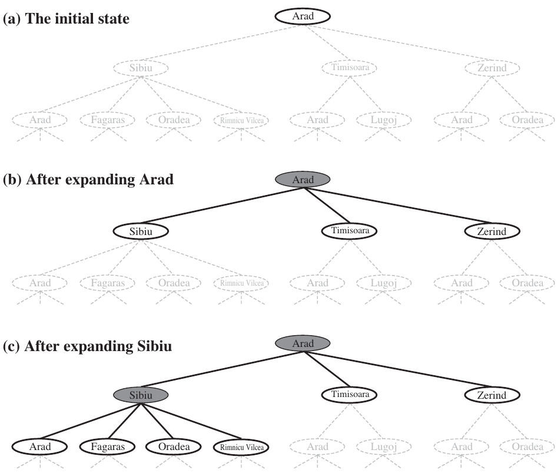
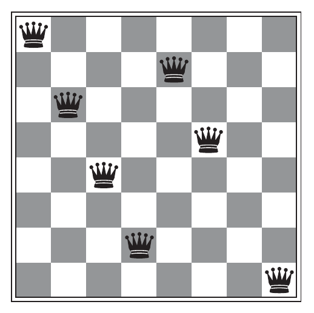

# Notion de stratégies d'exploration

Dans une résolution de problèmes par l'exploration, la manière dont un algorithme va explorer le problème -- autrement dit parcourir les noeuds états d'après la fonction successeur et le modèle de transition -- est appelée une **stratégie**. On distingue deux grandes catégories de stratégies :
* Les stratégies dîtes non informées
* Les stratégies dîtes informées

## Stratégie non informées
Une stratégie non informée se repose uniquement sur les informations fournies dans la description du problème, et n'en dispose pas d'autre.

Autrement dit, elle se contente simplement de produire des successeurs et d'être capable de différencier un état d'un état initial et d'un état final ; l'ordre de sélection des noeuds revêt lors (quasi) unique particularité.

Parmi ces stratégies non informés, on peut noter l'[exploration en largeur d'abord](https://fr.wikipedia.org/wiki/Algorithme_de_parcours_en_largeur), ou encore en [profondeur d'abord](https://fr.wikipedia.org/wiki/**Algorithme_de_parcours_en_profondeur),

D'autres explorations, plus sophistiquées, existent et tentent de répondre à certains problèmes inhérents à ces approches (*e.g.* utiliser DFS dans le cadre d'une profondeur infini, oops). C'est par exemple le cas de *Deep Limited Search*, qui impose une borne maximale $$\alpha$$ sur la profondeur de l'arbre. Pour trouver $$\alpha$$, l'on a recourt à l'étude (souvent mathématique) du problème.

## Stratégie informées
Une stratégie informée utilise des connaissances supplémentaires à la définition du problème qui vont permettre d'étendre le modèle du domaine et favoriser sa résolution. Souvent, il s'agit de connaissances expertes supplémentaires non réifiés (ou non réifiables) à l'intérieur du modèle.


Par exemple, utiliser la distance d'oiseau entre deux villes pour avoir de l'information supplémentaire et savoir qu'elle ville est la plus proche de l'état actuel.


Si l'on prend le problème des 8-reines par exemple, sa modélisation n'exclue pas par défaut tous les états inconsistants lorsqu'une reine est posée -- logique puisqu'on ne sait pas où on va la mettre. De fait, toutes les combinaisons existent *a priori* dans l'espace d'états. C'est grâce à des heuristiques qu'on va réussir à le réduire intelligemment.

